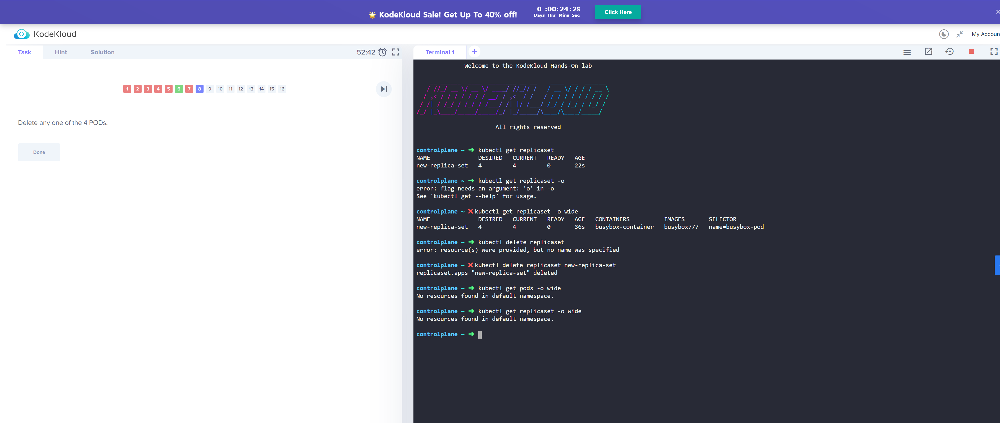
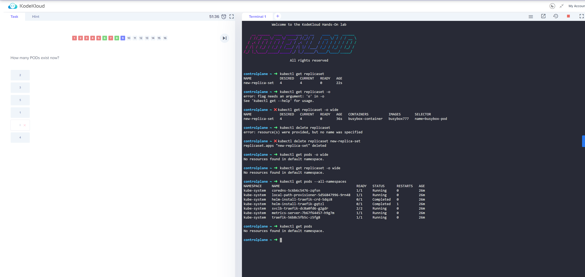

## 1. 문제

* image1의 내용에 따라 **kubectl delete replicaset~** 명령어를 이용하여 삭제함

* 그러나 해당 명령어 실행 이후 image2와 같이 실제 결과에서도 pod가 없었지만 문제에서는 오답처리됨

## 2. 해결과정
* 문제의 의도는 **kubectl delete pods~** 명령어를 이용하여 pod 삭제 시 replicaset 리소스 규격에 의해 계속 생성되므로 해당 상황을 확인해봐라.. 였으나 Uninteded로 replicaset delete로 풀어 발생한 상황

## 3. 결론
* 문제의 의도에 맞지 않게(?) 풀어 발생한 이슈.. 덕분에 KodeKloud의 문제 검증 방식을 조금 이해할 수 있었다