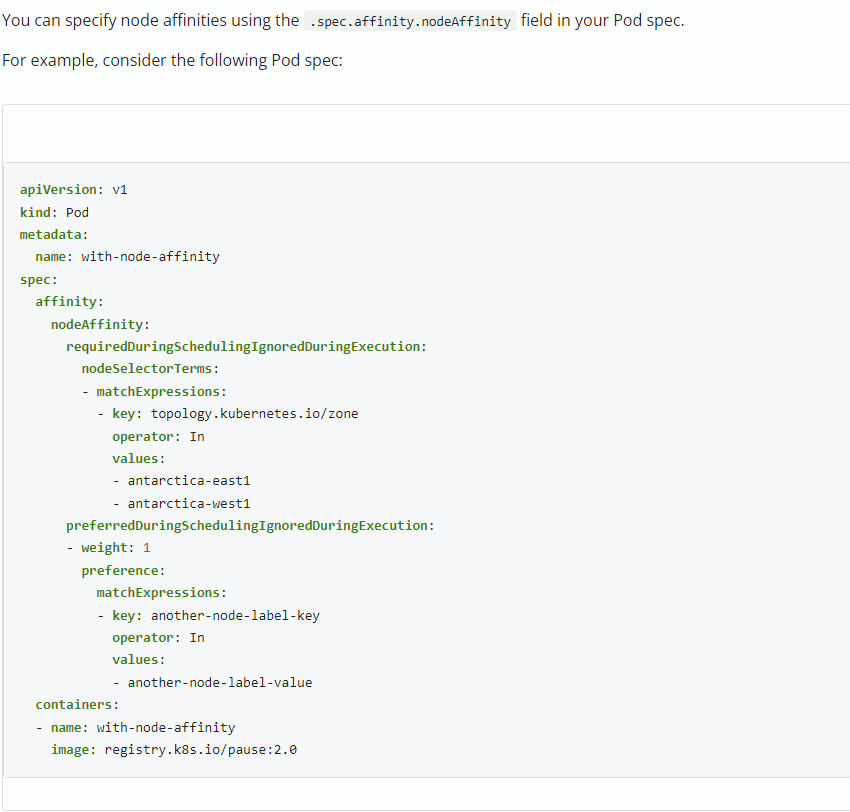

## 1. 문제
* 6,7번째 문제에서 k8s docs의 Node Affinity, Pod Affinity 예제를 이용해서 문제풀이를 진행했으나 지속적인 오답
* 문제 내용이 k8s docs 내용에서는 찾기 어려운 내용도 있어 해결 방법이 필요
  ``` 
  예를 들면 requiredDuringSchedulingIgnoredDuringExecution Affinity의 경우 k8s docs에서는 Pod에 대해서만 안내가 되어 있어 Deployment yaml에 적당히 붙여서 제출했는데 문법에러 발생 
  ```
  

## 2. 해결과정
* 아직 미해결

## 3. 결론
* 아직 미해결